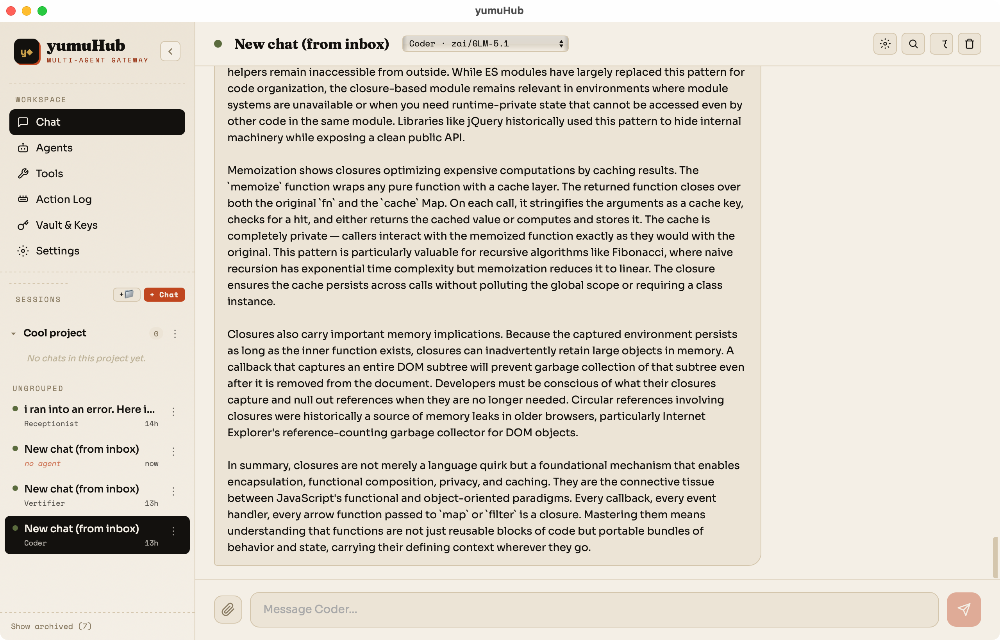

# yumuHub

**A chat-native hub for orchestrating a roster of independent AI agents.**

yumuHub is a personal, single-user desktop app that talks to any AI provider — Anthropic, OpenAI, z.ai, and more — and runs a team of genuinely independent agents. Each agent carries its own API key, personality, tools, and memory. Agents can spawn sub-agents, delegate work, and message each other over a shared bus — so handing a big task to one agent never freezes the rest.



---

## ✨ Highlights

- **🤖 Independent agent runtimes** — every agent is a self-contained config (provider, key, system prompt, tools, memory) running on its own runtime with per-chat history and abort control.
- **🔀 Multi-provider** — switch between Anthropic, OpenAI, z.ai, Claude Code Router, or a built-in Mock provider per agent. No vendor lock-in.
- **🧬 Agents that build teams** — agents can `spawn_agent` to create specialists on the fly, `delegate` via `send_to_agent`, and `configure_agent` to retool one another, all without leaving the chat.
- **🚌 Real message bus** — inter-agent messaging through a pub/sub bus with addressed routing, so delegation runs concurrently in the background.
- **🛠️ 20 built-in tools** — web search, calculators, file reading, image/video/audio generation (z.ai), and self-editing — grouped into categories you grant per agent.
- **🧠 Two genuinely novel reasoning tools** — `truth_only` (re-answers with social_context=0, politeness=0) and `adhd_reason` (surfaces tangentially-related angles). You won't find these anywhere else.
- **🔒 Self-editing sandbox** — agents can read and rewrite yumuHub's *own* source code in a jailed beta copy, never touching the running app.
- **📋 Persistent action log** — every tool call, delegation, and spawn is recorded chronologically so you can see exactly what your agents did.
- **🗝️ Vault** — keys live in a managed vault with semantic status, grouping, quarantine, and soft-delete — never hardcoded.

---

## 🧱 Architecture

yumuHub is intentionally a **two-file app**:

| Layer | File | Role |
|-------|------|------|
| **Frontend** | `src/YumuHub.jsx` (~6,900 LOC) | The entire React app — no TypeScript, no component library, no router. Inline styles, one color palette. |
| **Backend** | `src-tauri/src/main.rs` (~850 LOC) | Tauri/Rust shell — filesystem, sandbox jail, IPC (inbox/outbox), provider proxies, CCR lifecycle. |

The single-file frontend is a deliberate design choice: it lets the app read and improve *its own* source code through the self-editing feature.

**State** lives in `localStorage` (prefixed `yumuhub:`), with an optional disk mirror for chat history. The **universal system prompt** that shapes every agent lives at `~/yumuhub-workspace/yumuHub.md` and is editable from the Settings UI or the CLI.

---

## 🔌 Supported providers

| Provider | Models | Notes |
|----------|--------|-------|
| **Anthropic** | Claude Opus / Sonnet / Haiku 4.x | Native streaming |
| **OpenAI** | GPT-4o, GPT-4o-mini | OpenAI-compatible streaming |
| **z.ai** | GLM-4.x family (27 models across 6 categories) | Anthropic-format endpoint via a Rust curl proxy |
| **Claude Code Router** | Routed (default/think/longContext/webSearch) | Optional local daemon for multi-provider routing |
| **Mock** | echo-v1 | No key required — for testing without spending tokens |

---

## 🚀 Getting started

### Prerequisites

- **macOS** (Windows support is on the roadmap)
- [Node.js](https://nodejs.org/) (18+)
- [Rust](https://rustup.rs/) toolchain (`cargo`)
- [Tauri v2 CLI](https://tauri.app/) (installed via `npx`)

### Build & run

```sh
git clone https://github.com/yumu99/yumuhub.git
cd yumuhub
npm install
npx tauri build
```

The built app lands in `src-tauri/target/release/bundle/macos/yumuHub.app`. Drag it to `/Applications` and launch.

For active development, see [`REBUILD.md`](REBUILD.md) for the full quit-then-rebuild chain.

### Add your keys

Launch the app, open **Vault & Keys**, and add an API key for any provider you want to use (Anthropic, OpenAI, z.ai). Assign keys to agents in the **Agents** tab. Or just use the **Mock** provider to explore with no key at all.

---

## 📁 Project structure

```
src/YumuHub.jsx          ← the entire React app
src/main.jsx             ← React entry point
src-tauri/src/main.rs    ← Rust backend (filesystem, sandbox, proxies)
src-tauri/                ← Tauri shell config + icons
docs/                     ← design spec + screenshot
```

### Documentation

| File | Purpose |
|------|---------|
| [`CLAUDE.md`](CLAUDE.md) | Project instructions for AI coding assistants |
| [`CODEMAP.md`](CODEMAP.md) | Line-range index of the source — read before editing |
| [`REBUILD.md`](REBUILD.md) | Build & install chain with rationale |
| [`BACKLOG.md`](BACKLOG.md) | Feature backlog ranked by effort and priority |

---

## 🗺️ Roadmap

**In scope:** multi-agent chat · independent runtimes · inter-agent messaging · per-agent keys · provider switching · plugin tools · cross-device sync · local memory.

**Highest-leverage next step:** an MCP transport adapter — exposing the tool registry over the Model Context Protocol to unlock RAG, integrations, and a plugin ecosystem.

**Out of scope (for now):** multi-user / team accounts · fully autonomous open-ended swarms · model fine-tuning · marketplace billing.

---

## 📄 License

No license has been chosen yet. Until one is added, all rights are reserved by the author. If you'd like to use or contribute, please open an issue to discuss.

---

<p align="center"><em>Built as a single-user, chat-native multi-agent hub — somewhere between a code framework and a visual builder.</em></p>
